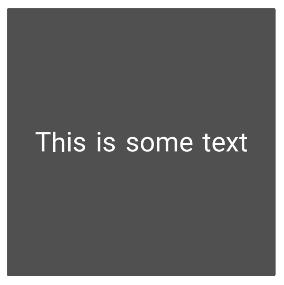

# aframe-mesh-ui-components

**aframe-mesh-ui-components** is a set of A-Frame components which aid in creating VR UIs for building VR user interfaces.

These components utilize [Felix Mariotto](https://github.com/felixmariotto/)'s [three-mesh-ui](https://github.com/felixmariotto/three-mesh-ui) library under the hood, adapting it to components fit for use with A-Frame.

# Import

## Module

You can install the module by installing its corresponding npm package:

`npm install aframe-mesh-ui-components`

You can then import it as an ES6 module or CommonJS:

```javascript
// ES6
import ThreeMeshUI from "aframe-mesh-ui-components";

// CommonJS
const ThreeMeshUI = require("aframe-mesh-ui-components");
```

## HTML &lt;script&gt; tag

Alternatively, you can include a minified or development version of the package via a `<script>` tag in your html:

```html
<!-- Make sure to also include a-frame's latest build ! -->
<script src="https://aframe.io/releases/1.4.0/aframe.min.js"></script>

<!-- minified -->
<script src="https://unpkg.com/aframe-mesh-ui-components@0.5.0/dist/aframe-mesh-ui.min.js"></script>

<!-- development -->
<script src="https://unpkg.com/aframe-mesh-ui-components@0.5.0/dist/aframe-mesh-ui.js"></script>
```

# Usage

## Font files

In order to display text from within the mesh-text component, a parent component must provide a fontFamily file and a fontTexture file.

The two font files used in the examples were taken from Felix Mariotto's [example assets](https://github.com/felixmariotto/three-mesh-ui/tree/master/examples/assets), and you can find their tutorial on how to create new fonts [here](https://github.com/felixmariotto/three-mesh-ui/wiki/Creating-your-own-fonts)

## Simple use case

What follows is a very rudimentary and simple use case. More examples can be found inside the [examples folder](https://github.com/Retchut/aframe-mesh-ui-components/tree/main/examples).

You can run these by cloning the repository and running the local development server.

### Code

```html
<!-- You can mix and match the UI components and any other A-Frame component! -->
<a-scene>
	<a-entity
		position="0 1.5 -1"
		mesh-container
		mesh-block="
			width: 1;
			height: 1;
			fontFamily: ./fonts/Roboto/Roboto-msdf.json;
			fontTexture: ./fonts/Roboto/Roboto-msdf.png;
		"
	>
		<a-entity
			mesh-text="
				content: This is some text;
				fontSize: 0.1
			"
		></a-entity>
	</a-entity>
</a-scene>
```

#### End result



### Components

#### mesh-container

The parent of a UI element must contain both a `mesh-container` and a `mesh-block` component.

The `mesh-container` component handles the recursive loading of all the `mesh-block` and `mesh-text` components contained in its entity, and all of its children.

#### mesh-block

A `mesh-block` component is equivalent to a `ThreeMeshUI.Block` object.

It receives the exact same properties a ThreeMeshUI Block would.

#### mesh-text

A `mesh-text` component is equivalent to a `ThreeMeshUI.Text` object.

It receives the exact same properties a ThreeMeshUI Text would.

# Scripts

## Development server

You can run a local development server by running the `npm start` command in the root of this project.

## Build generation

`npm run dist:min` - generates a minified build and its corresponding source map

`npm run dist:max` - generates a development build and its corresponding source map

`npm run dist` - generates both a minified and a development build and their corresponding source maps

# TODO

There are still some components which are missing implementation:

- Image blocks
- Buttons (also including keyboard utilities)
- Runtime UI modification utilities
